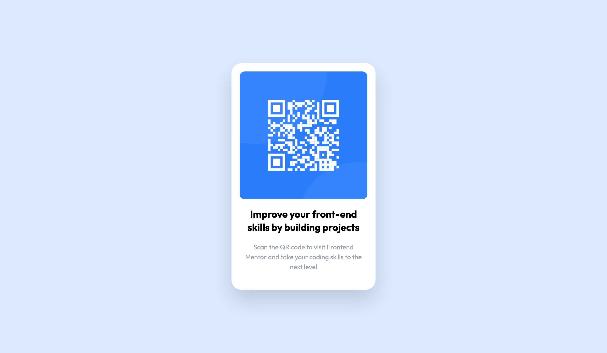

# Frontend Mentor - QR code component solution

This is a solution to the [QR code component challenge on Frontend Mentor](https://www.frontendmentor.io/challenges/qr-code-component-iux_sIO_H). Frontend Mentor challenges help you improve your coding skills by building realistic projects.

## Table of contents

- [Overview](#overview)
  - [Screenshot](#screenshot)
  - [Links](#links)
- [My process](#my-process)
  - [Built with](#built-with)
- [Author](#author)

## Overview

### Screenshot

### Links

- Solution URL: [GitHub](https://github.com/pawellenart/fem-qrcode)
- Live Site URL: [Vercel](https://fem-qrcode.vercel.app/)

## My process

### Built with

- HTML
- [TailwindCSS](https://tailwindcss.com/) - for styles
- [Vercel](https://vercel.com) - for deployment

## Author

- Frontend Mentor - [@pawellenart](https://www.frontendmentor.io/profile/pawellenart)
- Twitter - [@yourusername](https://www.twitter.com/yourusername)
